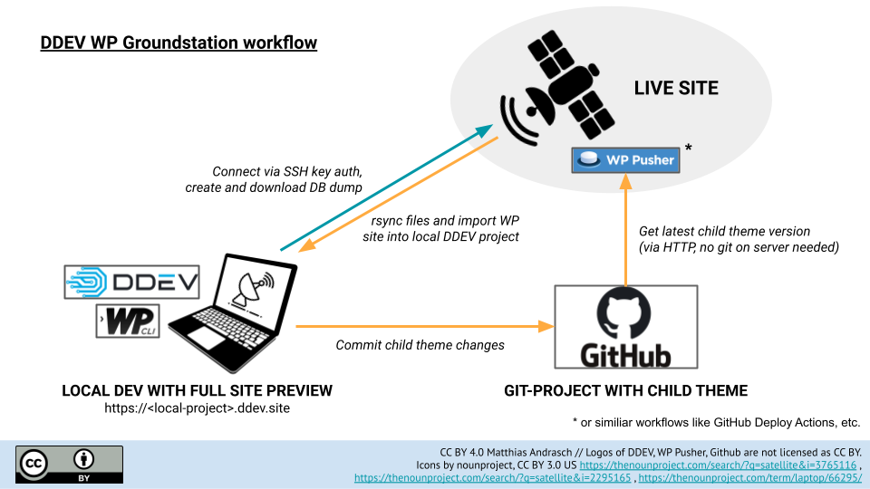
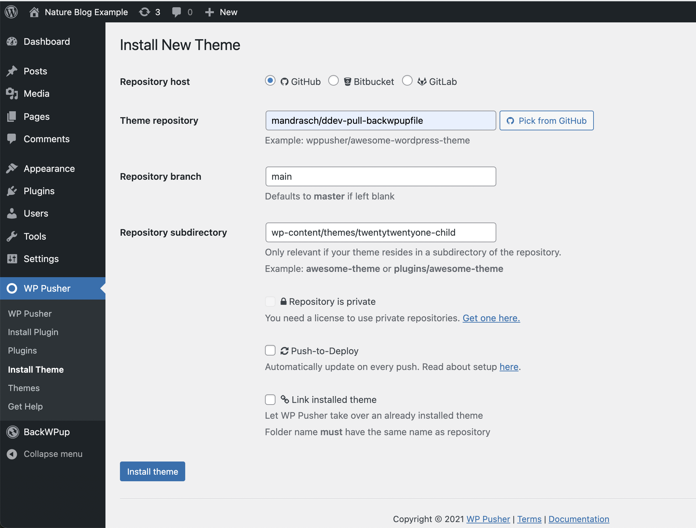

# DDEV WP Groundstation 🛰️

Status: Beta v.0.2 - Rewrite for [DDEV >= 1.18](https://github.com/drud/ddev/releases)

*Work in progress - please use it with caution and always backup important sites!*

## Screencast

- coming soon

## About the template

- Not sure if a wordpress update will break your site?
- Looking for a simple workflow to git-manage a child theme?
- You want to try things first in a safe local clone of your site?

DDEV WP Groundstation is a simple template which empowers you to work professionally with WordPress site clone in a local dev instance. The open source tool [DDEV-local](https://ddev.readthedocs.io/en/stable/) provides isolated development enviroments and has built-in support of WP-CLI. Your live site will be pulled to your local dev instance via the new and improved [DDEV providers / pull](https://ddev.readthedocs.io/en/stable/users/providers/provider-introduction/)-feature. Afterwards you can test all important changes locally.



<br>*While your live sites circling the web like satellites, groundstation is your mission control*

## Requirements:

1. ⚠️ DDEV newer than [1.18](https://github.com/drud/ddev/releases), check via `ddev -v`
1. Your webspace needs SSH connection capabilities (via SSH key)
1. Your webspace needs WP-CLI or mysqldump support

*(If your webspace doesn't meet this, see [ddev pull backwpupfile](https://github.com/mandrasch/ddev-pull-backwpupfile))*

## Setup

1. **Install a WordPress site on your webspace**

    You can skip this step (obviously), if you already have installed a WordPress site. 😉

2. **"Use this template"**

    Click "Use this template" and setup your own git repository.
    
3. **Clone it to local desktop**

     Clone the newly created repository to your local computer.

4. **Initialize the new DDEV project**

    ```bash
    ddev config --project-type=wordpress && ddev start
    ```

    Technical background: This will create a `.ddev/config.yaml-file`, see [config.yaml](https://ddev.readthedocs.io/en/stable/users/extend/config_yaml/)-docs for available options (PHP version, MariaDB/MySQL version, Apache/Nginx, etc. The file can be shared via git as well in teams, just uncomment the line `# !/.ddev/config.yaml` in `.gitignore`.

5. **Add your live sites SSH connection**

    Add the following to `.ddev/config.yaml` and replace it with your values:

    ```yaml
    web_environment:
    - PRODUCTION_SSH_USER=ssh12345678
    - PRODUCTION_SSH_HOST=ngcobalt12345678.manitu.net
    - PRODUCTION_SSH_WP_DIR=/home/sites/site12345678/web/nature-blog.mandrasch.eu
    ```

    and restart your project with `ddev restart` (!).

    Please verify beforehand that you can connect from your local terminal via `ssh-user@ssh-host` without a password ([SSH key authentication](https://dev.to/risafj/ssh-key-authentication-for-absolute-beginners-in-plain-english-2m3f)).

6. **Pull your live site files and db:**
    
    Just run:
    
    `ddev pull wp-production`

    This will pull all files and the database into your local project folder. The live sites URL will be replaced with your local project URL (*\<your-folder\>.ddev.site*) in the local database. Database connection settings will be changed in wp-config.php to connect with the local DDEV database. See `.ddev/providers/wp-production.yaml` for all steps.

    If everything worked, open your locally cloned site in the browser:

    `ddev launch`

7. **Add child theme to your live site via WPPusher**

    [WPPusher](https://wppusher.com/) has the great ability to add themes from subfolders, therefore it is very easy to add a child theme from a git project:

    

    Your webspace doesn't need git support, WPPusher works via Web-Api to get the latest files.

    You need to edit `.gitignore` in order to track your child theme. If it is added in `.gitignore`, it won't be overriden if you pull from your live site.

## TODOs

- [ ] Test `wp db export`, only tested mysqldump
- [ ] Test with multiple webhosts / webspace providers

## Reset

**Forgot password?**

Run following command:

```shell
ddev exec wp user update admin --prompt=user_pass
```

**Delete DDEV project and clean git directory:** 

Delete all changes, only leave git tracked files:

```shell
ddev delete -O
git clean -fdx
```
