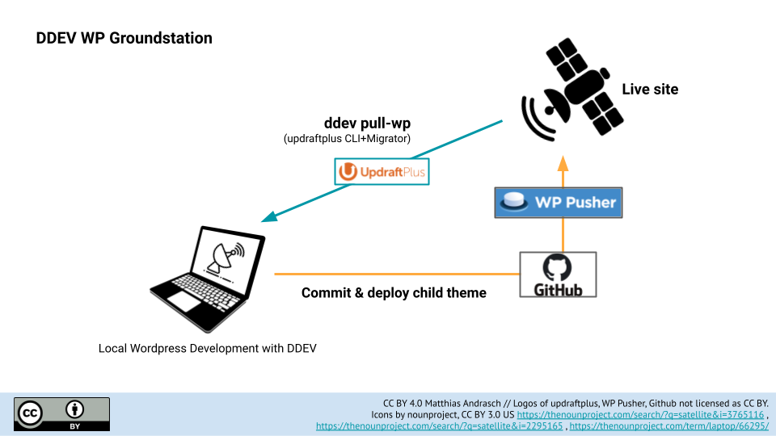
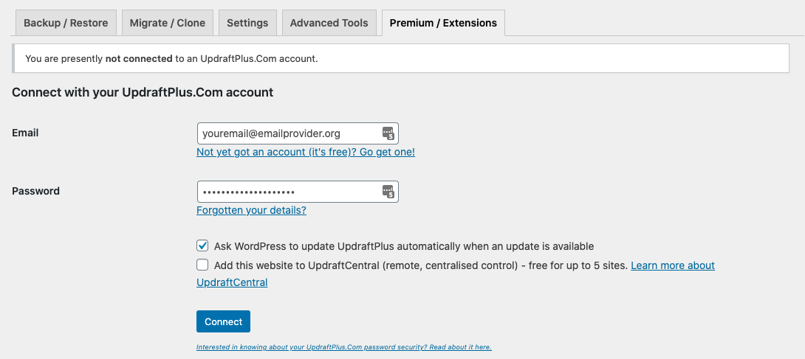
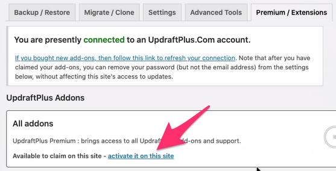

# DDEV WP Groundstation 🛰️

*While your live sites circling the web like satellites, groundstation is your safe homebase for wordpress development in DDEV.*

⚠️ Status: Work in progress, use at own risk 👷‍♀️ ⚠️

⚠️ Make sure your DDEV is newer than 1.18! 👷‍♀️ ⚠️

## Description

- Starting a new child theme?
- Scared a wordpress update will break your old site?
- Looking for a simple workflow to git-control the child theme of a site?

DDEV WP Groundstation provides custom commands to empower you to work professionally with Wordpress, git and [DDEV-local](https://ddev.readthedocs.io/en/stable/). It uses the new DDEV Providers / Pull feature.



## Setup

1. **"Use this template"**

    Click "Use this template", setup your own repository.
    
2. **Clone it**

     Clone the newly created repository to your local computer.

3. **Set up the DDEV project**

    ```bash
    ddev config --project-type=wordpress
    ddev start
    ```

    This will create a .ddev/config.yaml-file, which can be shared via git 
    in your team. Just remove the comment from `# !/.ddev/config.yaml` in `.gitignore`. See [config.yaml](https://ddev.readthedocs.io/en/stable/users/extend/config_yaml/)-docs for available options (PHP version, MariaDB/MySQL version, Apache/Nginx, etc.)

4. **Pull your live site**

    Requirements

    - SSH access (via SSH key)
    - mysqldump and php available via CLI

    
    TODO: https://stackoverflow.com/a/45927977/809939


Other methods: 
    b) Fresh install:
    
    See https://ddev.readthedocs.io/en/stable/users/cli-usage/#wordpress-quickstart
    
    c) Download a backwpup .zip-file:
    https://github.com/mandrasch/ddev-pull-backwpupfile


<hr>

Old docs:


## Description

- Starting a new child theme?
- Scared a wordpress update will break your old site?
- Looking for a simple workflow to git-control the child theme of a site?

DDEV WP Groundstation provides custom commands to empower you to work professionally with Wordpress, git and [DDEV-local](https://ddev.readthedocs.io/en/stable/). Current commands: `ddev install-wp`, `ddev setup-symlinks` and `ddev pull-wp`.

Have fun!

## 🎥 Demo (Screencast)

1. **Developing and deploying a child theme [https://www.youtube.com/watch?v=4_Qa2tCDrbc](https://www.youtube.com/watch?v=4_Qa2tCDrbc)**
2. **Pulling a website [https://www.youtube.com/watch?v=9V9DmjIlrbI](https://www.youtube.com/watch?v=9V9DmjIlrbI)**

## Setup

1. **"Use this template"**

    Click "Use this template", setup your own repository.
    
2. **Clone it**

     Clone the newly created repository to your local computer.
    
2. **Change project name in `.ddev/config.yaml`**

    ```shell
    name: my-example-site
    ```

3. **Install fresh wordpress**

    ```shell
    cd your-newly-created-repository/
    ddev start
    ddev install-wp
    ```

## Use case 1: Developing a child theme

Demonstration: [https://www.youtube.com/watch?v=4_Qa2tCDrbc](https://www.youtube.com/watch?v=4_Qa2tCDrbc)

1. **Create your childtheme folder in `wp-content/themes`**

    See `wp-content/themes/`, there is already a child theme as an example.

2. **Run `ddev setup-symlinks`** 
    
    This will create a symbolic link into the `/ddev-wordpress/wp-content/themes`-folder.

**Optional: Deployment via WPPusher **

1. **Install [wppusher](https://docs.wppusher.com/) on your live site**

2. **Set up the child theme and change the subdirectory value to `wp-content/themes/your-childtheme`**

    See: https://docs.wppusher.com/article/17-setting-up-a-plugin-or-theme-on-github

## Use case 2: Pulling a live website

### Prerequisites

This command is possible with the help of the WPCLI and site migration feature of [Updraftplus premium](https://updraftplus.com/shop/updraftplus-premium/)($).

- [DDEV](https://www.ddev.com/ddev-local/) installed on your local machine
- [updraftplus premium](https://updraftplus.com/shop/updraftplus-premium/) license - activated on local and live site
- SSH access, WPCLI and rsync available on webspace of the live website

### Pull

1. **Activate updraftplus premium on live and local wordpress (see details below)**

2. **Pull the live site to your local wp:**

    ```shell
    # pull a live website to local DDEV:
    ddev pull-wp ssh_username@ssh_host.xyz /path/to/wordpress/on/remote
    ```
    
    Example command for [Uberspace webspace](https://uberspace.de/en/):

    ```shell
    ddev pull-wp UBERSPACE_USER@draco.uberspace.de /var/www/virtual/UBERSPACE_USER/html/#
    
    # Real live example:
    ddev pull-wp wpdemo@draco.uberspace.de /var/www/virtual/wpdemo/html/
    ```

If you want to restore the fresh state of wordpress after migration, you can run `ddev create-local-backup` before pulling.

*For technical details of the implementation see [".ddev/commands/web"](https://github.com/programmieraffe/ddev-pull-wp/tree/main/.ddev/commands/web).*

#### Detailed tutorial

1. **Login into local wordpress**

    Login to https://pull-wp.ddev.site/wp-admin/ with user "admin" and your chosen password.

    [Use `ddev launch` to open the local site directly in browser]

2. **Login to updraftplus premium  ($)**

    Activate updraftplus premium license with your credentials. To do that, navigate to Wordpress Dashboard > Settings > updraftplus:

    https://pull-wp.ddev.site/wp-admin/options-general.php?page=updraftplus

    

3. **Activate "all addons" to enable WPCLI and Migrator feature**

    Make sure to click "activate it on this site":

    

4. **Optional: Create a local backup**

    We create a local backup (this will be useful later) after successful activation of updraftplus premium:

    ```shell
    ddev create-local-backup
    ```

5. **Install updraftplus premium on remote wordpress site**

    Install updraftplus with this [.zip file](https://updraftplus.com/wp-content/uploads/updraftplus.zip) (Source: [Updraftplus Docs](https://updraftplus.com/support/installing-updraftplus-premium-your-add-on/))

    Activate updraftplus premium by logging in with your updraftplus account

    

    and click "activate it on this site":

    

6. **Pull remote site backup and restore (migrate) it**

    Now we can pull the backup from the live website to our local site:

    ```shell
    ddev pull-wp ssh_username@ssh_host.xyz /path/to/wordpress/on/remote
    ```

    *This command connects to the remote live website via SSH, creates a backup via updraftplus CLI, rsyncs the backup files to local DDEV, restores it with help of updraftplus Migrator and CLI feature.*

    You can find out the wordpress path of your live site via

    1. Login to your site via ssh
    2. Change directory to wordpress folder
    3. Check if WPCLI is available with "wp core version"
    4. Get the wordpress folder path with "pwd" command (print working directory)

7. **Open and test updates locally**

    Open `https://pull-wp.ddev.site` to see the migrated site which now runs on your local machine.

    The local login credentials are replaced by the credentials of the live website. You can now test a bigger wordpress update in peace - without breaking the live website.

    A good practice could be to use tools like Disable Emails, WP Debug Bar, etc. Activate debug log and install plugin Debug bar e.g.:

    ```shell
    ddev exec wp config set WP_DEBUG true --raw --path=wordpress
    ddev exec wp config set WP_DEBUG_LOG true --raw --path=wordpress
    ddev exec wp config set WP_DEBUG_DISPLAY false --raw --path=wordpress
    ddev exec wp plugin install debug-bar --activate --path=wordpress
    ```

    Or use the [WP Debugging](https://wordpress.org/plugins/wp-debugging/) plugin.


## Reset

1. **Reset your local site**

    If you have created a local restore point in the beginning (ddev create-local-backup), you can restore it here:

    ```shell
    ddev reset-wp
    ```
    If you haven't, things maybe a little bit more complicated:

    After a restore process you need to activate the updraftplus premim license or CLI-addon/Migrator-addon again in WP dashboard unfortunately. Otherwise you'll get "Error: 'updraftplus' is not a registered wp command".

2. **(optional) Delete transferred backups**

    If you want to cleanup the transferred backups, run:

    ```shell
    ddev delete-backups
    ```

    (This will not delete your local restore point from installation)

3. **Start with ddev pull-wp again**

## Advanced / FAQ

### Why?

Why not just use DDEVs built-in wordpress support? *DDEV is a great toolbox, but it implements Wordpress with the [roots/bedrock-Boilerplate](https://ddev.readthedocs.io/en/stable/users/cli-usage/#wordpress-quickstart) (composer). This starter works without composer since composer is not officially supported by Wordpress Core.* 

### Local PHP/MySQL version

See .ddev/config.yaml to change the local docker enviroment to be similiar to your remote webspace/server. You can also use nginx instead of apache.

### Working with git?

If you have a theme checked out with git on remote website, this will be transferred to the local enviroment. Updraftplus does not delete .git-folders while migration (which is nice).

### Forgot password?

Run following command:

```shell
ddev exec wp user update admin --prompt=user_pass --path=wordpress/
```

### Full/hard reset

Drop database datables and remove wordpress/-directory:

```shell
ddev delete-wp
```
If you need to remove other non-tracked files:
(Caution: also deletes ignored files + symlinked-/ folders)

```shell
git clean -fdx
```
Delete complete DDEV containers:

```shell
ddev delete -O
```

If you made changes to DDEV files from this git repo, which you want to delete:

```
git reset --hard`
```
